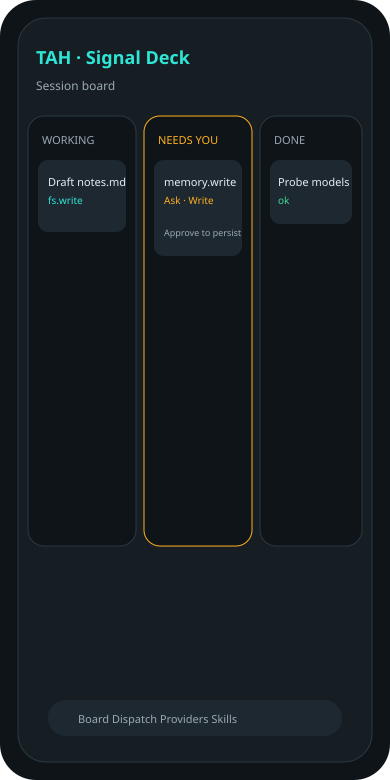
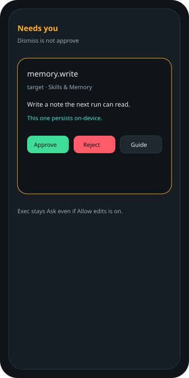
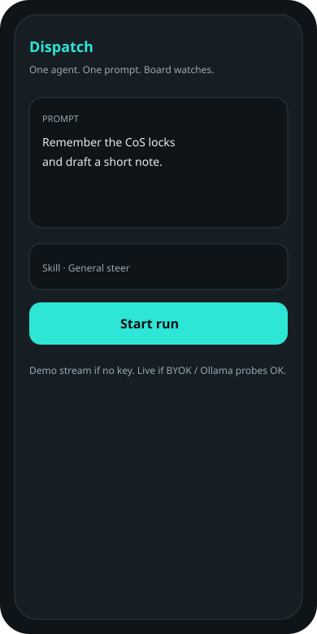

# TAH — The Agent Harness

**Steer one AI agent from your phone. The home screen is a board, not a chat.**

TAH is a sideloadable Android shell (`app.tah.shell`) branded **Signal Deck**. You dispatch a run, watch it on Working / Needs you / Done, and tap a permission card when the agent wants a tool. Approve, reject, or guide. Nothing risky runs silently.

[Install](#install) · [What it does](#what-it-does) · [What it does not do](#what-it-does-not-do) · [Guide](docs/GUIDE.md)

<p>



</p>

## Why this exists

Most agent apps on a phone collapse into a transcript and then either refuse to act or act without showing the tool. TAH inverts that:

1. **Board first.** Failed and budget-hit are chips on Done — not extra columns.
2. **Cards for tools.** A tool that is not on the timeline did not happen.
3. **Ask by default.** Exec never auto-runs. Allow edits is not exec.
4. **Needs-you is a real stop.** Notification plus deep link. Dismiss is not approve.

## What it does

| You see | What is true in 0.5.0-m4 |
|---------|---------------------------|
| Demo or live token stream | Demo is on-device. Live is your BYOK or Ollama LAN OpenAI-compatible endpoint. No TAH proxy. |
| Multi-tool loop | Planner queues a short sequence until wrap-up, reject, stop, or budget. |
| `memory.write` | Persists a note under Skills & Memory. |
| `fs.read` / `fs.write` | Persist under the **app-private workspace**. Not shared phone storage. Visible on Skills → Workspace. |
| `web.fetch` | After Ask, HTTP GET of the URL on the card. 32 KiB cap. |
| `shell.exec` | In-process `date`, `echo`, `ls`. Anything else is refused. No `/bin/sh`. |
| Skills | Bundled markdown, paste, system file picker, workspace files. |
| Stop | Session detail stop control. Cancelled chip on Done. |
| Foreground notice | Up while a run is active. Not immortal. OEM killers still win. |

Package: `app.tah.shell`  
Version: `0.5.0-m4` (versionCode 5)  
minSdk 26 · compileSdk 35 · Kotlin · Jetpack Compose · Material 3

## What it does not do

Do not read this as a desktop agent or a Termux replacement.

- No shared-storage filesystem and no `/bin/sh`. Workspace + allowlist only.
- No Play Store build in this milestone.
- No multi-agent swarm inside the app.
- No claim that the model emits native tool-call JSON. The planner is prompt + prior-tool heuristics.
- No “runs forever in the background” story.

Those gaps are listed again in [SUMMARY.md](SUMMARY.md) and [docs/AC-CHECKLIST.md](docs/AC-CHECKLIST.md).

## Install

### From GitHub Actions (recommended)

1. Open [Actions → Android debug APK](https://github.com/NaustudentX18/tah/actions)
2. Latest green run → artifact **tah-debug-apk**
3. `adb install -r` the APK, or open it on-device after allowing that source

Tags `v*` also publish a Release with `tah-debug.apk`.

### From Android Studio

JDK 17. CI uses Gradle 8.9.

```bash
gradle :app:assembleDebug
adb install -r app/build/outputs/apk/debug/app-debug.apk
```

## Signal Deck

| Token | Hex | Role |
|-------|-----|------|
| Primary | `#2EE6D6` | Accent / harness |
| Surface | `#0E1418` | Board background |
| Needs you | `#FFB020` | Gate |
| Success | `#3DDC97` | Applied / allowed |
| Reject | `#FF5C6A` | Stop |

No OFH, Claude, Warp, Termux, or OpenClaw marks in the product.

## Advice if you extend this

1. Keep receipts honest. If you add real `fs.write`, gate it and show the path on the card before the write.
2. Do not add a fourth board column for Failed.
3. Put new tools through `ToolPlanner` + `ToolRuntime` + `PermissionPolicy`.
4. Treat OEM battery text as documentation, not a feature.
5. Next honest milestone: model tool-JSON **or** one scoped SAF write — not both in one weekend.

## Docs

- [User guide](docs/GUIDE.md)
- [Spec](docs/SPEC.md)
- [Acceptance checklist](docs/AC-CHECKLIST.md)
- [Milestone log](SUMMARY.md)
