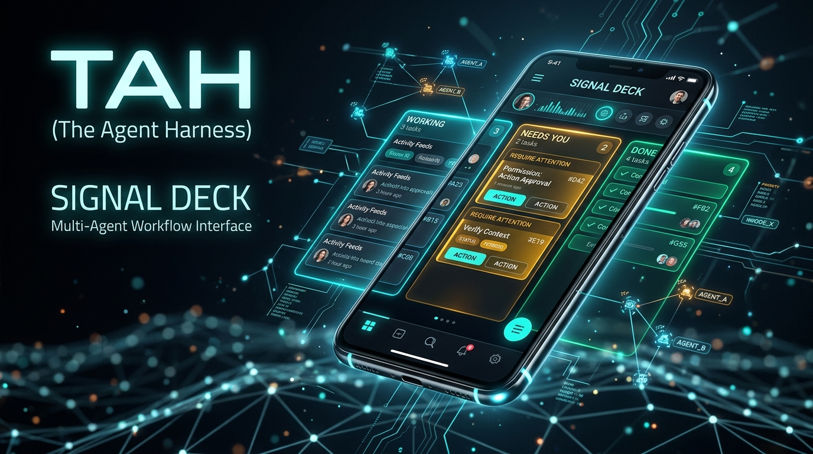
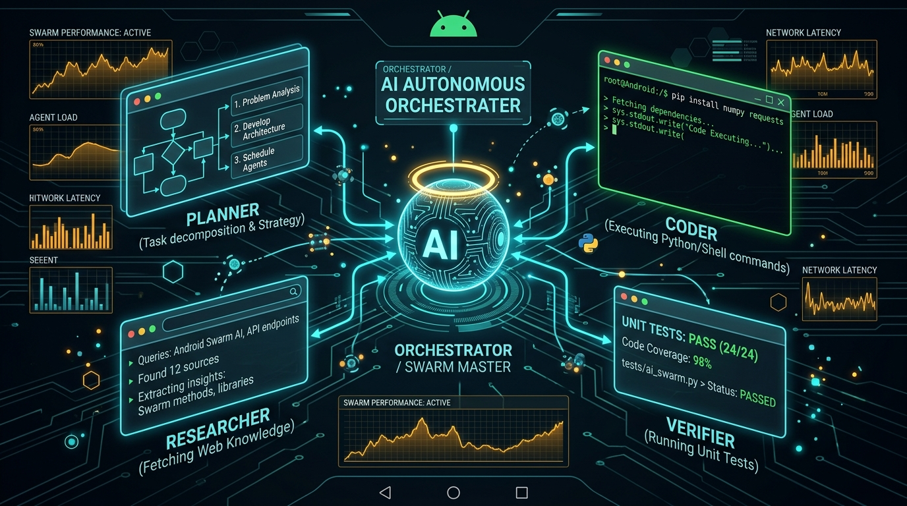

<p align="center">
  
</p>

<h1 align="center">⚡ TAH — The Agent Harness ⚡</h1>

<p align="center">
  <strong>Steer autonomous AI agent swarms directly from your phone. The home screen is a live board, not a chat.</strong>
</p>

<p align="center">
  
  
  
  
  
</p>

<p align="center">
  <a href="#-quick-start">🚀 Quick Start</a> •
  <a href="#-key-capabilities">✨ Key Capabilities</a> •
  <a href="#-multi-agent-swarm">🤖 Multi-Agent Swarm</a> •
  <a href="#-tools--real-execution">🛠️ Tools & Shell</a> •
  <a href="#-screen-gallery">📱 UI Gallery</a> •
  <a href="#-test--build-environment">🧪 Test & Build</a> •
  <a href="docs/GUIDE.md">📖 Full Guide</a>
</p>

<p align="center">
  
</p>

---

## 🌟 Why TAH Exists

Most mobile AI apps trap you in an endless chat transcript that can’t actually touch your device, or they run unmonitored scripts behind your back. 

**TAH (The Agent Harness)** inverts that with **Signal Deck**:
1. 📋 **Board First:** Runs organize into three live columns — `Working`, `Needs you`, and `Done`. No cluttered chat history.
2. 🎴 **Cards for Tools:** If a tool didn't show up on a card, *it didn't run*. Full transparency and receipts.
3. 🛑 **Human-in-the-Loop Gating:** Real shell commands, file edits, and network requests pause at `Needs you`. Approve with a tap, reject, or inject steering guidance on the fly.
4. 🤖 **Native Swarm & Subagents:** An Orchestrator can decompose complex missions and spawn specialized subagents (Planner, Coder, Researcher, Verifier) to work together.
5. 🔋 **Persistent Execution:** Backed by Android Foreground Services with CPU `WakeLock` protection and battery-optimization exemption to keep agents alive.

---

## ✨ Key Capabilities

| Feature | What TAH Delivers |
|---|---|
| ⚡ **Live & Demo Streaming** | Stream live responses from any **OpenAI-compatible endpoint** (Ollama LAN, OpenAI, Groq, OpenRouter, vLLM) or test instantly offline with on-device demo tokens. |
| 🧰 **Native Tool-Calling JSON** | Emits standard OpenAI function-calling schemas (`tools`). Streams parameter chunks in real time and translates model choices directly into actionable cards. |
| 💻 **Real Process Shell (`shell.exec`)** | Dual-mode execution: fast built-in allowlist (`date`, `echo`, `ls`) or full `/system/bin/sh` process execution with timeout safety, exit codes, and stdout/stderr capture. |
| 📂 **Device Filesystem (`fs.*`)** | `fs.read`, `fs.write`, and `fs.list` handle both the sandboxed app workspace and real on-device storage with permission checks. |
| 🌐 **Card-Gated Web Fetch (`web.fetch`)** | Perform HTTP GET lookups with preview cards, length bounds (32 KiB cap), and human approval before transmission. |
| 🧠 **Persistent Skills & Memory (`memory.write`)** | Agents record notes, learned facts, and workspace pointers that survive reboots and feed subsequent runs. |
| 🛡️ **Safety & Security First** | Gated CoS (Chain of Security) policy: dangerous operations (`Exec`, `Write`, `Network`) **never** execute silently. |

---

## 🤖 Multi-Agent Swarm

<p align="center">
  
</p>

TAH is built from the ground up for agent teamwork:
- 👑 **Orchestrator:** Breaks down high-level user missions, delegates subtasks, and synthesizes results.
- 📐 **Planner:** Produces structured execution plans, dependency graphs, and strategies.
- 💻 **Coder:** Writes code, creates files via `fs.write`, and runs commands through `shell.exec`.
- 🔍 **Researcher:** Queries web endpoints via `web.fetch` and extracts key information.
- ✅ **Verifier:** Runs verification scripts, inspects unit test results, and validates task outputs.

Subagents are created on demand via `agent.spawn(role, prompt)` and appear as linked sessions directly on the Signal Deck board.

---

## 📱 UI Gallery

<p align="center">
  
  
  
</p>

<p align="center">
  <em>Session Board (Working / Needs You / Done) • Needs-You Approval Card • Dispatch Run Modal</em>
</p>

### Signal Deck Design Palette

| Token | Hex | Meaning & Role |
|---|---|---|
| **Primary** | `#2EE6D6` | Neon Cyan accent, active harness status, running indicators |
| **Surface** | `#0E1418` | Deep obsidian board background |
| **Needs you** | `#FFB020` | Golden amber attention gate for approvals and permissions |
| **Success** | `#3DDC97` | Emerald green applied actions, verified results, and allowed tools |
| **Reject** | `#FF5C6A` | Coral red stop button, rejected actions, and fatal chips |

---

## 🚀 Quick Start

### 1. Download & Sideload APK
1. Head over to [GitHub Actions → Latest Run](https://github.com/NaustudentX18/tah/actions) or GitHub Releases.
2. Download the `tah-debug-apk` artifact (`app-debug.apk`).
3. Install via `adb`:
   ```bash
   adb install -r app-debug.apk
   ```
   *Or download directly onto your phone and tap to install.*

### 2. Configure Your Provider
- **Offline Demo:** Ready out-of-the-box. No API keys or network connection required!
- **Ollama on LAN:** Go to **Settings → Provider → Ollama LAN**, enter your local IP (e.g., `http://192.168.1.100:11434/v1`), and choose your model (`llama3.2`, `mistral`, `qwen2.5-coder`).
- **OpenAI / BYOK:** Go to **Settings → Provider → BYOK**, enter your endpoint (`https://api.openai.com/v1`) and API key.

### 3. Launch Your First Mission
1. Tap **+ Dispatch**.
2. Type a goal, for example:
   > *"Check device uptime, list directory contents, and save a summary report."*
3. Watch the cards appear in **Working**.
4. When a card slides into **Needs you**, tap **Approve**, **Reject**, or type an in-line **Guide** to steer the agent!

---

## 🧪 Test & Build Environment

TAH includes a zero-friction, reproducible build and test setup for Windows, macOS, and Linux.

### Run All Unit Tests
Run the standalone test suite in one command:
```powershell
# Windows PowerShell
.\scripts\test.ps1

# Or with Gradle wrapper
.\gradlew.bat :app:testDebugUnitTest
```
```bash
# macOS / Linux
./gradlew :app:testDebugUnitTest
```
*Outputs clean HTML test reports to `app/build/reports/tests/testDebugUnitTest/index.html`.*

### Build Debug APK
Assemble and package the APK instantly:
```powershell
# Windows PowerShell
.\scripts\build.ps1

# Build and automatically install to connected device
.\scripts\build.ps1 -Install
```
```bash
# macOS / Linux
./gradlew :app:assembleDebug
adb install -r app/build/outputs/apk/debug/app-debug.apk
```

### Google Android CLI (`android`)
Manage SDKs, emulators, and device layouts directly from your terminal:
```bash
# Check environment and SDK status
android info

# List installed SDK packages and build tools
android sdk list

# Manage virtual devices
android emulator list
```

---

## 📂 Repository Structure

```text
tah/
├── app/
│   ├── src/main/java/app/tah/shell/
│   │   ├── data/            # Models, SessionRepository, MemoryStore, WorkspaceStore
│   │   ├── notify/          # NeedsYouNotifier, notification channels
│   │   ├── runtime/         # AgentLoop, ProcessShell, ToolRuntime, OpenAiCompatClient
│   │   └── ui/              # Compose UI: Board, Cards, Dispatch, Settings, Skills
│   └── src/test/java/       # Comprehensive unit tests (ProcessShell, ToolCalls, Policies)
├── docs/
│   ├── images/              # Logos, banners, architecture graphics
│   ├── screens/             # SVG UI previews
│   ├── GUIDE.md             # Complete user guide & tips
│   └── SPEC.md              # Architecture specification
├── scripts/
│   ├── test.ps1             # Automated test runner with reporting
│   └── build.ps1            # APK builder & adb deployer
├── gradlew & gradlew.bat    # Gradle 8.9 wrapper
└── README.md                # Project documentation
```

---

## 🤝 Contributing & Extending

Want to add new tools or agent behaviors?
1. Define the tool schema in `OpenAiCompatClient.createToolsJson()`.
2. Add the tool handler to `ToolRuntime.apply()`.
3. Set the security level in `PermissionPolicy.requiresAsk()`.
4. Run `.\scripts\test.ps1` to ensure all tests pass!

---

<p align="center">
  <strong>Built with ❤️ for hackers, researchers, and AI builders who want agents they can trust and steer.</strong><br>
  MIT License • 2026 TAH Project
</p>
